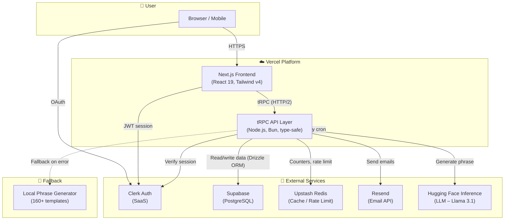

# 🏛️ Architecture Diagram (Container Level)

## Explanation

The diagram above shows the **Container-level** architecture of **The Trump's New Groove**.

### Nodes (Containers)

| Container | Technology | Purpose |
|-----------|------------|---------|
| **Next.js Frontend** | React 19, Tailwind v4, Framer Motion | Delivers the UI, handles client‑side routing and state. |
| **tRPC API Layer** | tRPC v11, Node.js/Bun, Drizzle ORM | Type‑safe backend logic. Orchestrates all data access and external calls. |
| **Clerk Auth** | Clerk SaaS | User authentication via Google/GitHub OAuth. Session verification. |
| **Supabase** | PostgreSQL (Drizzle ORM) | Persistent storage for user wallets, bets, badges, newsletter subscriptions. |
| **Upstash Redis** | Redis REST API | Real‑time global click counter, daily rate limiter, leaderboard. |
| **Resend** | Email REST API | Sends confirmation and welcome emails for the newsletter. |
| **Hugging Face Inference** | REST API (Llama 3.1) | Generates satirical phrases on demand. |
| **Local Fallback Generator** | Node.js module | Generates a random phrase from 160+ templates if the LLM API fails. |
| **Vercel Cron** | Cron Job (weekly) | Triggers `/api/cron/prophecy` every Monday to select a new Prophecy of the Week. |

### Flows

1. **User → Frontend:** All UI interactions (click, view profile, place bet) are handled by the Next.js frontend.
2. **Frontend → tRPC API:** Every API call (click, get phrase, place bet, subscribe newsletter, resolve bet) goes through tRPC, which validates the request and performs the business logic.
3. **tRPC ↔ Clerk:** For authenticated routes, the API verifies the user’s session token against Clerk before processing.
4. **tRPC ↔ Supabase:** All persistent data (users, bets, badges, newsletter) is read/written through Drizzle ORM to the PostgreSQL database.
5. **tRPC ↔ Upstash Redis:** The global click counter is incremented on every click; a daily rate limit is enforced per user; the leaderboard is stored in a sorted set.
6. **tRPC ↔ Resend:** When a user subscribes or confirms their email, the API sends the appropriate email via Resend.
7. **tRPC ↔ Hugging Face:** When a new phrase is requested, the API calls the LLM. If the call fails, it falls back to the local generator.
8. **Vercel Cron → tRPC:** Every Monday, a secured endpoint picks a random phrase and sets it as the “Prophecy of the Week”, making it available for betting.

All components communicate over encrypted HTTPS. The local development environment mirrors this setup using Docker containers for PostgreSQL and Redis.
